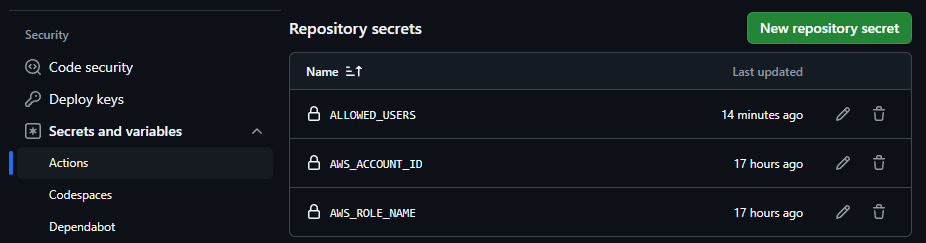

# S3 Public Contents

S3 Public Contents は、AWS CDK を使用して構築されたサーバーレスアプリケーションで、ユーザー認証付きでファイルを Amazon S3 にアップロードし、CloudFront 経由で公開するためのインフラを提供します。

## 特徴

-   **認証付きファイルアップロード**: Firebase Authentication を利用して、許可されたユーザーのみがファイルをアップロードできます。
-   **署名付きURL**: セキュアなファイルアップロードのために、有効期限付きの署名付きURLを生成します。
-   **自動デプロイ**: AWS CDK を使用して、インフラ全体 (S3, CloudFront, Lambda, API Gateway) を簡単にデプロイできます。
-   **カスタムレイヤー**: Python Lambda 関数の依存関係を管理するためのカスタムレイヤーを自動生成します。
-   **CORS対応**: 異なるオリジンからのファイルアップロードを許可するように設定されています。
-   **コンテンツ配信**: CloudFront を使用して、アップロードされたファイルを高速に配信します。

## プロジェクト構成

```
.
├── .npmignore                      # npm パッケージに含めないファイルを指定
├── README.md                       # このドキュメント
├── bin
│   └── s3-public-contents.ts       # CDK アプリケーションのエントリーポイント
├── cdk.context.json                # CDK コンテキストファイル
├── cdk.json                        # CDK の設定ファイル
├── jest.config.js                  # Jest テストフレームワークの設定ファイル
├── lambda                          # Lambda 関数のソースコード
│   └── sign-url                    # 署名付きURL生成 Lambda
│       ├── index.py                # Lambda 関数のハンドラー (Python)
│       └── requirements.txt        # Python 依存関係
├── lib
│   └── s3-public-contents-stack.ts # CDK スタック定義 (TypeScript)
├── package.json                    # プロジェクトの依存関係とスクリプト
├── public
│   └── index.html                  # アップロード用 HTML ファイル
├── scripts
│   └── copy-html.mjs               # HTML ファイルをコピーし、環境変数を置換するスクリプト
├── test
│   └── s3-public-contents.test.ts  # テストファイル (現在はコメントアウト)
└── tsconfig.json                   # TypeScript コンパイラの設定ファイル

```

-   `bin/`: CDK アプリケーションのエントリーポイント。
-   `lambda/`: Lambda 関数のソースコード。
    -   `sign-url/`: 署名付きURLを生成する Lambda 関数のコード。
-   `lib/`: CDK スタックの定義。S3 バケット、CloudFront ディストリビューション、Lambda 関数、API Gateway などのリソースを作成。
-   `public/`: 静的アセット (HTML, CSS, JavaScript)。アップロード用のウェブページ。
-   `scripts/`: 補助的なスクリプト。`copy-html.mjs` は `public/index.html` を `dist/` にコピーし、環境変数を埋め込みます。

## 環境変数

以下の環境変数を設定する必要があります。`.env` ファイルを作成するか、CDK デプロイ時に環境変数として渡してください。

-   **`ALLOWED_USERS`**: ファイルアップロードを許可するユーザーIDのリスト (カンマ区切り)。Firebase Authentication を使用する場合に必要。例: `'user1,user2,user3'`

以下の環境変数は、CDK デプロイ時に自動的に設定されます（`index.html` 内のプレースホルダー）。

-   `API_ENDPOINT`: API Gateway のエンドポイント URL.
-   `CLOUDFRONT_URL`: CloudFront のドメイン名。
-   `S3_BUCKET_URL`: アップロードに使用する S3 バケットの URL.

## インストールとデプロイ

### 前提条件

-   Node.js (v18 以上) と npm がインストールされていること
-   AWS CLI がインストールされ、適切に設定されていること
-   AWS アカウントと適切な IAM 権限を持っていること

### 手順

1.  **リポジトリのクローン**

    ```bash
    git clone <リポジトリのURL>
    cd <リポジトリ名>
    ```

2.  **依存関係のインストール**

    ```bash
    npm install
    ```

3.  **環境変数の設定**

    GitHubの設定として環境変数を設定します。
    

4.  **CDK のデプロイ**

    ```bash
    npm run build
    npx cdk deploy
    ```
    デプロイが完了すると、以下の出力が表示されます。

    -   `S3PublicContentsStack.CloudFrontDomain`: CloudFront ディストリビューションのドメイン名
    -   `S3PublicContentsStack.ApiUrl`: API Gateway の URL
    -  `S3PublicContentsStack.BucketURL`: S3バケットURL

5.  **`index.html` の更新**

    `scripts/copy-html.mjs` スクリプトは、`public/index.html` を `dist/index.html` にコピーし、以下のプレースホルダーを CDK の出力値で置き換えます。

    -   `${API_ENDPOINT}`: API Gateway の URL
    -   `${CLOUDFRONT_URL}`: CloudFront のドメイン名
    -   `${S3_BUCKET_URL}`: S3 バケットの URL

    `npm run build`コマンド実行時に自動で更新されます。

## 使い方

1.  デプロイ後に表示された CloudFront のドメイン名 (または `index.html` の `CLOUDFRONT_URL` の値) をブラウザで開きます。
2.  ファイルをドラッグ＆ドロップするか、「Browse Files」ボタンをクリックしてファイルを選択します。
3.  「Upload File」ボタンをクリックします。
4.  Firebaseで認証している場合は、認証後にアップロードされます。
5.  アップロードが成功すると、ファイルの URL が表示され、クリップボードにコピーされます。

## API エンドポイント

-   **`/upload` (POST)**: ファイルアップロード用の署名付き URL を取得します。

    -   **リクエストヘッダー**:
        -   `Authorization`: `Bearer <Firebase Authentication Token>` (オプション、Firebase 認証を使用する場合)
        -   `Content-Type`: `application/json`

    -   **リクエストボディ**:

        ```json
        {
          "key": "ファイル名.ext",
          "fileType": "ファイルのMIMEタイプ"
        }
        ```

    -   **レスポンス (成功時)**:

        ```json
        {
          "url": "署名付きURL",
          "key": "アップロード先のS3キー（プレフィックス付き）"
        }
        ```
      - **レスポンス (失敗時)**:
        適切なステータスコードとエラーメッセージを含むJSONレスポンス。

## 署名付きURLの生成フロー

1.  クライアント (ブラウザ) は、API Gateway の `/upload` エンドポイントに POST リクエストを送信します。リクエストには、ファイル名、ファイルタイプ、認証トークン (オプション) が含まれます。
2.  API Gateway は、リクエストを `SignUrlLambda` 関数に転送します。
3.  `SignUrlLambda` 関数は、以下の処理を行います。
    -   リクエストパラメータ (ファイル名、ファイルタイプ) の検証。
    -   認証トークンが存在する場合、Firebase Authentication を使用してトークンを検証し、許可されたユーザーかどうかを確認。
    -   S3 キーにアップロード日時のプレフィックスを追加 (例: `user_id/20240724/ファイル名.ext`)。
    -   AWS SDK for Python (Boto3) を使用して、S3 `put_object` 操作の署名付き URL を生成。
    -   署名付き URL と S3 キーを含む JSON レスポンスをクライアントに返す。
4.  クライアントは、受信した署名付き URL を使用して、S3 バケットにファイルを直接アップロードします。

## カスタムレイヤーの作成

`lib/s3-public-contents-stack.ts` では、カスタムリソースを使用して、Python Lambda 関数のための依存関係を含むレイヤーを自動的に作成しています。

- `build-layer-lambda` フォルダーを作成し、その中にCustom Resource用のLambda関数を作成します。
- `createPythonLayer` 関数は、指定されたパッケージ名 (`requests`, `PyJWT`, `cryptography`) のレイヤーをビルドします。

## ライセンス

このプロジェクトは MIT ライセンスの下で公開されています。詳細は `LICENSE` ファイルを参照してください。
